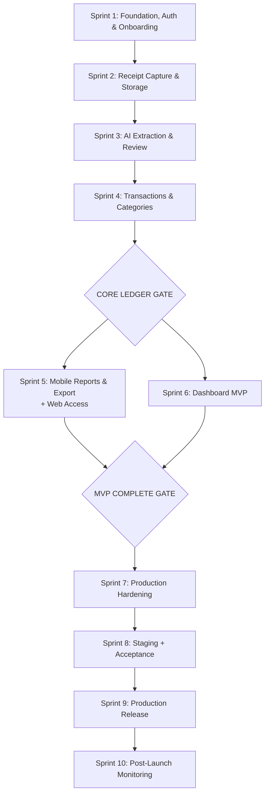

# Hesably MVP Development Plan

This document defines the dependency-aware vertical-slice implementation plan for the Hesably MVP, ensuring strict adherence to the architecture, security, and product requirements.

## Resolved Architectural Decisions
- **Account Linking Implementation:** Uses Supabase native Identity Linking. Users authenticate via Phone OTP on mobile and link an Email identity through the mobile app settings. The web dashboard exclusively uses Email Magic Link to authenticate the same `user_id`. The dashboard middleware must strictly block any orphaned web sign-ups from users without a linked mobile business profile.
- **Category Deletion Behavior:** Strict referential integrity is enforced (`ON DELETE RESTRICT`). Default categories cannot be hard-deleted (only hidden). Custom categories can only be hard-deleted if they are not referenced by any transactions. If a category is in use, the UI must require the user to reassign historical transactions to a new category before allowing deletion.

---

## 1. Core Dependency Graph

---

## 2. Parallelism Rules & Exact Execution Order

### Exact Execution Order
1. **Sprint 1**
2. **Sprint 2**
3. **Sprint 3**
4. **Sprint 4**
5. **CORE LEDGER GATE**
6. **Sprint 5** & **Sprint 6** (Parallel allowed)
7. **MVP COMPLETE GATE**
8. **Sprint 7**
9. **Sprint 8** (Staging Gate)
10. **Sprint 9** (Production Gate)
11. **Sprint 10**

### Parallelism Rules
Sprints 1–4 must be strictly sequential.
Sprints 5 and 6 may run in parallel **ONLY** if:
- Sprint 4 is merged to `develop`.
- Database contracts are stable.
- Shared API/data contracts are stable.
- No shared schema changes are being modified independently.
- Each agent works in an isolated branch/worktree.
- Integration happens through reviewed PRs.
- Parallel implementation agents **must not** modify the same shared contract, schema, API contract, or architecture decision without coordination and explicit review.

---

## 3. Sprint Definitions

### Sprint 1 — Foundation, Auth & Onboarding
- **Goal:** Establish the application foundation, authentication, business onboarding, and only the database primitives actually required for this sprint.
- **Scope:** 
  - Repository/application foundation.
  - Flutter foundation (approved routing, localization).
  - Supabase client integration.
  - Phone OTP authentication and session persistence.
  - Business Setup (one-business-per-user MVP behavior).
  - Approved `businesses` persistence and ownership/RLS.
- **Out-of-Scope:** Dashboard, AI, Transactions (no transaction schema or enums), Email Auth.
- **Prerequisites:** Supabase project provisioned.
- **Database Changes:** `businesses` table, initial RLS policies. Do NOT introduce transaction schema/enums.
- **Tests:** Authentication, OTP, session restoration, onboarding, relevant RLS isolation.
- **Security Checks:** Supabase SMS rate limiting, ensure `owner_id` uniqueness constraint (1 business/user).
- **Observability Checks:** Use mechanisms approved by `docs/observability-and-reliability.md`.
- **Definition of Done:** User can complete Phone OTP → Business Setup → Home → close/reopen app → authenticated session remains valid.
- **Rollback Considerations:** Non-destructive. Can drop `businesses` table if needed.

### Sprint 2 — Receipt Capture & Storage
- **Goal:** Enable secure mobile image capture, approved compression, and private bucket upload.
- **Scope:** Camera/Gallery integration, image quality checks, manual-entry bypass, approved image compression strategy, private receipt storage (approved object path), receipt metadata record, secure access/signed URL mechanism.
- **Out-of-Scope:** AI extraction, transaction saving, web-based receipt capture.
- **Prerequisites:** Sprint 1 (Auth & Business Profile).
- **Database Changes:** `receipts` bucket creation, Storage RLS policies (private storage).
- **Tests:** Camera permission failure, gallery selection, upload success, upload failure, manual-entry path, unauthorized Storage access.
- **Security Checks:** Private bucket enforcement. File size limits, supported MIME types, and minimum resolution as defined in approved image/security specifications.
- **Observability Checks:** Mechanisms approved by `docs/observability-and-reliability.md`.
- **Definition of Done:** A valid receipt image can be securely captured/uploaded and retrieved by the authorized business. No Gemini call yet. No confirmed transaction creation.
- **Rollback Considerations:** Empty and recreate the storage bucket if needed.

### Sprint 3 — AI Extraction, Review & Confirmation Boundary
- **Goal:** Integrate AI extraction via Edge Functions, returning draft data for user review.
- **Critical Rule:** AI extraction output is NEVER trusted final business data. Required lifecycle: Receipt → AI extraction → validated draft → Review/Edit → explicit user confirmation → confirmed transaction. The Edge Function must not directly create a confirmed transaction.
- **Scope:** Supabase Edge Function, Gemini integration, strict server-side schema validation, AI draft persistence, extraction lifecycle, idempotency, Flutter processing state, review/edit UI, confidence indicators, manual fallback.
- **Out-of-Scope:** Saving confirmed transactions to the permanent ledger.
- **Prerequisites:** Sprint 2 (Image Upload).
- **Database Changes:** `ai_extractions` table, RLS (insert/read). Retention cleanup implemented only according to `docs/data-lifecycle.md`.
- **Tests:** Valid extraction, malformed model response, partial extraction, low confidence, non-receipt, blurry input, timeout, retry, duplicate/idempotent request, authentication/authorization failure.
- **Security Checks:** Reference approved secret-management strategy for Gemini API keys.
- **Observability Checks:** Mechanisms approved by `docs/observability-and-reliability.md`.
- **Definition of Done:** Edge Function successfully returns strictly typed draft JSON; Flutter app displays the draft extraction with confidence indicators and manual fallback.
- **Rollback Considerations:** Edge Function can be redeployed/reverted independently.

### Sprint 4 — Transactions & Categories
- **Goal:** Finalize the core financial ledger and category management.
- **Scope:** Approved categories schema, approved transactions schema, transaction creation after confirmation, manual transaction creation, transaction list, filters, search, details, edit, delete, custom category management.
- **Transaction Type Rule:** Do not invent new backend transaction enum values. Use exactly `income` and `expense` as approved in `docs/product-contract.md`. UI wording must map to these backend semantics.
- **Category Deletion Behavior:** Default categories cannot be hard-deleted. Unused custom categories may be deleted if approved by the data model. Custom categories referenced by transactions must follow the approved archive/hide/reassign behavior. Never break historical transactions.
- **Out-of-Scope:** Advanced reports, Web Dashboard.
- **Prerequisites:** Sprint 3 (Draft AI Data).
- **Database Changes:** `categories` table, `transactions` table, explicit RLS, Foreign Key constraints.
- **Tests:** Widget tests for list/details/filtering/search. RLS tests.
- **Security Checks:** Adversarial RLS validation for: INSERT, UPDATE, DELETE, SELECT, forged `business_id`, and cross-business access.
- **Observability Checks:** Mechanisms approved by `docs/observability-and-reliability.md`.
- **Definition of Done:** Transactions persist correctly; manual and AI-confirmed entries work; list is viewable, filterable, and editable.
- **Rollback Considerations:** Dropping/altering `transactions` requires down migrations and caution.

---

## 4. CORE LEDGER GATE
This gate is passed ONLY when:
- Transactions persist correctly.
- Manual transactions work.
- Confirmed AI transactions work.
- Transaction calculations are correct.
- Category rules work.
- Filtering/search work.
- Editing works.
- Deletion rules work.
- Cross-business access is prevented.
- RLS tests pass.
- Critical tests pass.
- Shared transaction semantics are stable.

*Only after this gate may Sprint 5 and Sprint 6 begin.*

---

## 5. Sprint 5 — Mobile Reports & Export (and Web Access Linking)
- **Goal:** Provide business insights and data export directly on mobile, plus the Web Access linking mechanism.
- **Scope:** Period selection, income, expenses, net, category breakdown, previous-period comparison, PDF export, CSV/Excel export, native share sheet, settings, approved business profile changes.
- **Web Access Explicit Flow:** Existing mobile-authenticated user → Enable Web Access → link email to existing identity → verify email → dashboard magic link → same user/business. Must explicitly handle already-linked email, invalid email, duplicate email, verification failure, unlinking, and account deletion. Do not create a second account.
- **Aggregation Rule:** Database-side aggregation is the default (Postgres views, RPC/functions, or other approved mechanisms). Client-side calculations allowed only for presentation-level calculations that do not duplicate authoritative business calculations.
- **Out-of-Scope:** The Dashboard web app itself.
- **Prerequisites:** Sprint 4 (Transactions).
- **Database Changes:** Postgres views or RPCs for aggregations based on approved DB design.
- **Tests:** Unit tests for financial aggregation math, PDF/CSV generation, Account Linking flows.
- **Security Checks:** Ensure exports strictly apply `business_id` RLS (no cross-tenant leakage).
- **Observability Checks:** Validate export memory usage on low/mid-spec Android devices.
- **Definition of Done:** Accurate reports rendered; PDF/CSV successfully generated and shared. Web Access linking flow complete.
- **Rollback Considerations:** Mobile app rollback (requires app store update).

### Sprint 6 — Dashboard MVP
- **Goal:** Deliver the Next.js companion web dashboard.
- **Scope:** Next.js App Router, TypeScript, approved UI stack, magic-link authentication, linked-business validation, protected routes, Overview, Transactions, filters, search, details, edit, delete, Reports, Export, Categories, Settings, Business Profile, Web Access state, logout.
- **Data Contract:** Use generated Supabase TypeScript types. Do not create dashboard-specific database semantics.
- **Out-of-Scope:** Public self-signup, web-based receipt capture.
- **Prerequisites:** Sprint 4 (Transactions).
- **Database Changes:** None (consumes existing schema).
- **Tests:** Next.js SSR Auth guard tests, browser-level validation.
- **Security Checks:** Verify protected routes, authenticated requests, same RLS as mobile, no service-role credentials in browser, no public self-signup, and unlinked accounts cannot access business data.
- **Observability Checks:** Mechanisms approved by `docs/observability-and-reliability.md`.
- **Definition of Done:** Dashboard implementation includes browser-level validation, user can log in via magic link and view/edit transactions.
- **Rollback Considerations:** Instant Vercel rollback.

---

## 6. MVP COMPLETE GATE
The MVP is complete ONLY when ALL of the following pass:
- **Mobile:** Authentication, onboarding, receipt capture, upload, AI extraction, review/edit, confirmation, manual entry, transactions, categories, reports, exports, settings, Web Access linking.
- **Dashboard:** Magic-link login, linked-account validation, overview, transactions, edit/delete, reports, exports, categories, settings, logout.
- **Cross-platform:** Same database semantics, same transactions, same categories, same reports/business calculations, mobile-created data visible on dashboard, dashboard changes reflected correctly on mobile.
- **Security:** RLS, Storage privacy, secret protection, account-linking protection.
- **Quality:** Automated tests, static analysis, lint/type checks, builds, critical E2E path.
- **UX:** Arabic RTL, loading states, empty states, recoverable errors, low-end Android usability.

*No production hardening starts before this gate passes.*

---

## 7. Sprint 7 — Production Hardening
- **Goal:** Harden the already-complete MVP. **It must NOT deploy to production.**
- **Scope:** Full test suite, E2E validation, adversarial security review, RLS verification, Storage verification, performance validation, database query/index review based on evidence (do not invent indexes merely by table name), error-state polish, CI/CD validation, observability verification, production configuration review, rollback readiness.
- **Out-of-Scope:** New feature development.
- **Prerequisites:** Sprints 1-6 complete & MVP Complete Gate passed.
- **Tests:** E2E smoke tests.
- **Definition of Done:** System is classified as either `BLOCKED` or `READY FOR STAGING` (Not production).
- **Rollback Considerations:** Testing and refining rollback procedures.

### Sprint 8 — Staging & Acceptance
- **Goal:** Deploy the complete MVP to staging and validate it as a real system.
- **Scope:** Staging Supabase, staging Edge Functions, staging dashboard, staging mobile configuration/build, migrations, smoke tests, E2E, realistic test receipts, account linking validation, mobile/dashboard consistency.
- **Definition of Done:** All critical flows pass in staging. No unresolved Critical release blockers. Business/user acceptance is completed. (Staging Gate passed).

### Sprint 9 — Production Release
- **Goal:** Release the approved MVP to production.
- **Scope:** Production migrations, production Edge Functions, production dashboard, approved mobile release artifacts, secrets verification, smoke tests, version/tag, release report.
- **Precondition:** `production-readiness.md` must say `READY FOR PRODUCTION`.
- **Rollback:** Document separate rollback strategies for: Mobile, Dashboard/Vercel, Edge Functions, Database (do not assume every migration is reversible), and Configuration.

### Sprint 10 — Post-Launch Monitoring
- **Goal:** Observe the production system without adding new features.
- **Scope:** Monitor according to `docs/observability-and-reliability.md`. Review auth failures, receipt upload failures, AI failures, extraction latency, low-confidence rate, confirmation rate, report/export failures, dashboard authentication failures, unexpected AI usage/cost, performance regressions, and security incidents.
- **Definition of Done:** Produce a post-launch report.

---

## 8. Branching Rules
- **Flow:** `feature/*` or `fix/*` → Pull Request → `develop` → Pull Request → `main`
- **Hotfix:** `hotfix/*` → Pull Request → `main`
- Every sprint branch must be created from the latest approved `develop`.
- Do NOT create Sprint N from stale `develop`.
- Do NOT merge automatically.

---

## 9. Sprint Definition of Done (Global)
Every sprint must include:
- Implementation complete.
- Tests added/updated.
- Static analysis.
- Lint/typecheck where applicable.
- Build validation.
- Security validation.
- Documented error states.
- Documentation updated when contracts change.
- Completion Artifact.
- Human review.
- PR created.
*(A feature is not complete just because its happy path works.)*
