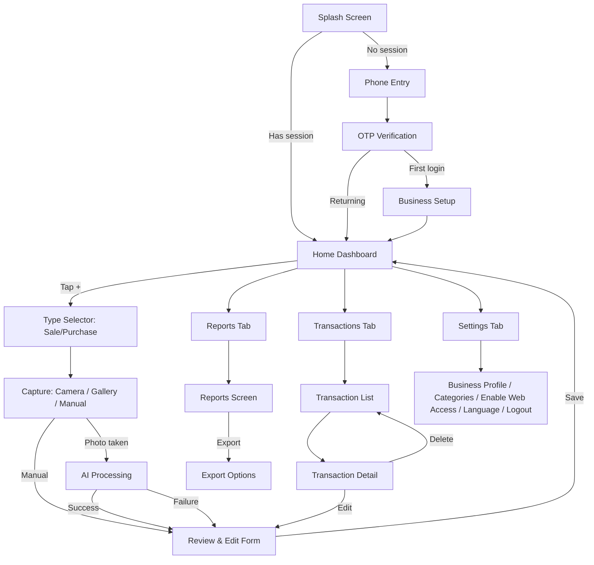

# User Flow — Mobile App (Flutter)

**Scope**: This document covers the **Flutter mobile app only**. For the web dashboard, see `user-flow-dashboard.md`. Companion to `feature-list.md`.

---

## 1. Onboarding Flow (first-time user)

1. **Splash Screen** → checks if user has an active Supabase session.
   - If yes → go straight to Home Dashboard (step 2.1).
   - If no → go to Phone Entry.
2. **Phone Entry Screen** → user enters phone number → tap "Send Code".
3. **OTP Verification Screen** → user enters 6-digit code → verified via Supabase Phone Auth.
   - Error state: wrong code → inline error, allow resend after cooldown.
4. **Business Setup Screen** (one-time, only after first successful login)
   - Business name (text input)
   - Business type (dropdown: Retail / Restaurant / Pharmacy / Service / Other)
   - Confirm button → creates the business profile record → navigates to Home Dashboard.

---

## 2. Core Loop: Add New Transaction

This is the most-used flow in the app and should be reachable in **one tap** from anywhere (floating action button on Home).

1. **Home Dashboard** → tap "+" (Add Transaction) button.
2. **Type Selector** → user picks: "Sale / Income" or "Purchase / Expense".
3. **Capture Screen**
   - Option A: Open camera → take photo of receipt.
   - Option B: Pick existing photo from gallery.
   - Option C: "Skip — enter manually" (bypasses AI entirely, goes to step 6 with empty form).
4. **Processing State** (after photo captured)
   - Loading indicator while image uploads and Gemini API extracts data.
   - Timeout/error handling: if extraction fails or takes too long → show message + button "Enter manually instead" (never a dead end).
5. **Review & Edit Screen**
   - Pre-filled form with extracted fields: date, amount, vendor/customer, category, (line items if available).
   - Low-confidence fields visually flagged (e.g., subtle highlight) prompting the user to double-check.
   - User can edit any field.
   - Thumbnail of the original photo shown, tappable to view full-size.
   - Category can be changed via a picker (defaults to AI suggestion).
6. **Confirm & Save**
   - Tap "Save" → record written to Supabase → photo stored in Storage bucket, linked to the record.
   - Success feedback (brief toast/snackbar) → return to Home Dashboard, which now reflects updated totals.

---

## 3. Browse & Manage Transactions

1. **Home Dashboard** → tap "Transactions" tab (bottom navigation).
2. **Transaction List Screen**
   - Chronological list, most recent first, grouped by date.
   - Each row: thumbnail, vendor/customer name, category, amount (color-coded income/expense), date.
   - Top of screen: filter bar (date range, category, type) + search field.
3. Tap a transaction → **Transaction Detail Screen**
   - All fields shown read-only by default.
   - "Edit" button → reopens the Review & Edit form (same as step 2.5 above) pre-filled with saved values.
   - "Delete" button → confirmation dialog → removes record and associated image.

---

## 4. Reports Flow

1. **Home Dashboard** → tap "Reports" tab (bottom navigation).
2. **Reports Screen**
   - Period selector: This Week / This Month / Custom Range.
   - Summary cards: Total Income, Total Expenses, Net.
   - Category breakdown (list or simple bar chart), sorted by highest spend.
   - Comparison line vs previous period ("+15% vs last month").
3. Tap "Export" → **Export Options Sheet**
   - Choose format: PDF or Excel/CSV.
   - Choose period (defaults to what's currently selected).
   - Confirm → file generated → share sheet opens (WhatsApp, email, save to device, etc.).

---

## 5. Settings Flow

1. **Home Dashboard** → tap "Settings" (bottom navigation or profile icon).
2. **Settings Screen**
   - Business profile (name, type) → editable.
   - Manage Categories → list of categories, add/edit/delete custom ones (default categories cannot be deleted, only hidden).
   - **Enable Web Access** → link an email address to the account for dashboard login (see `user-flow-dashboard.md`, section 1). Optional step, not required to use the mobile app.
   - Language toggle (Arabic default / English).
   - Logout.
   - Delete account (with confirmation + explanation of data loss).

---

## Edge Cases & Error States to Handle

| Situation | Expected behavior |
|---|---|
| No internet connection during capture | Queue locally, show "will process when back online" (or, for true MVP, simply block with a clear message — decide based on Phase 1 vs Phase 2 scope). |
| AI returns low/no confidence on all fields | Treat as extraction failure → route to manual entry, don't force user to fix garbage data. |
| User captures a non-receipt image (e.g., a random photo) | Gemini should return an empty/near-empty result → show "Couldn't read this as a receipt, try again or enter manually." |
| Duplicate receipt (same photo/data submitted twice) | Not required for MVP, flag as a Phase 2 nice-to-have (simple hash check on image). |
| OTP not received | Resend button after a cooldown timer (e.g., 30s), plus a "having trouble?" support link. |
| User deletes a transaction by mistake | Confirmation dialog before delete is the only safeguard in MVP (no undo/trash in Phase 1). |

---

## Simplified Flow Diagram

